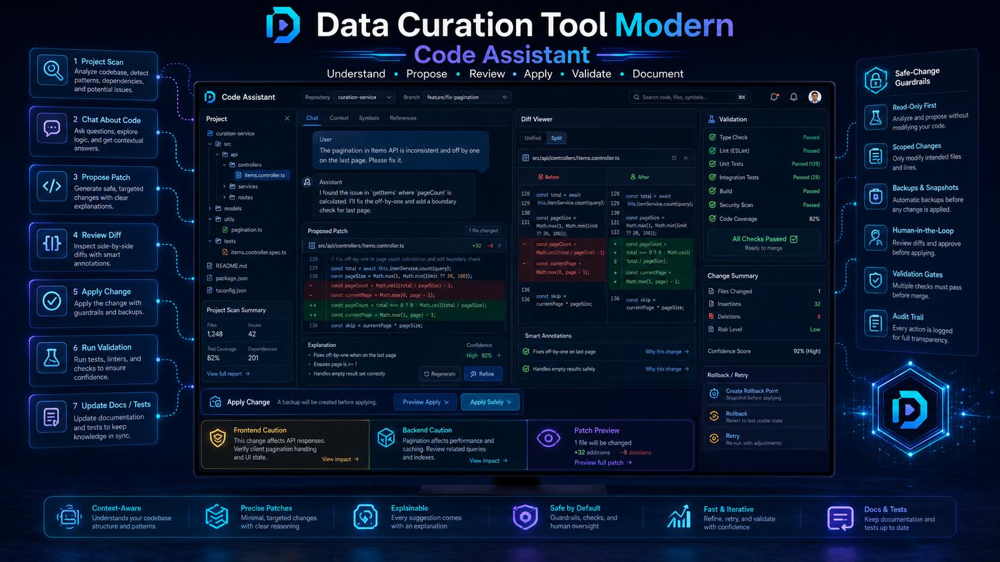

# Contributing and Development

<!-- DCT_VISUAL_START -->

<!-- DCT_VISUAL_END -->


This page is for developers modifying the project.

## Project architecture

Common areas:

| Path | Purpose |
| --- | --- |
| `data_curation_tool/app.py` | FastAPI app creation and route registration. |
| `data_curation_tool/routers/` | API route modules. |
| `data_curation_tool/services/` | Business logic and workflow services. |
| `data_curation_tool/models/` | Model catalog, registry, and adapters. |
| `data_curation_tool/static/app.js` | Main frontend application. |
| `data_curation_tool/static/styles.css` | Frontend styles. |
| `tests/` | Regression tests. |
| `docs/` | Release notes and docs. |
| `docs/wiki/` | User/developer wiki. |

## Development setup

Install normally:

Windows:

```bat
install.bat
```

Linux:

```bash
./install.sh
```

Run:

```bash
python -m uvicorn data_curation_tool.app:create_app --factory --host 127.0.0.1 --port 7865
```

or use the included run scripts.

## Validation commands

Python compile check:

```bash
python -m py_compile data_curation_tool/app.py data_curation_tool/__init__.py
```

Frontend syntax check:

```bash
node --input-type=module --check < data_curation_tool/static/app.js
node --check data_curation_tool/static/app.js
```

Targeted tests:

```bash
pytest -q tests/test_api_smoke.py
```

For feature patches, add a dedicated regression test under `tests/`.

## Frontend caution

The frontend is loaded as an ES module. Duplicate top-level declarations can make the whole UI blank before app code runs. Always use:

```bash
node --input-type=module --check < data_curation_tool/static/app.js
```

## Backend caution

Keep routers thin when possible. Put durable workflow logic in services and keep model-specific loading/inference logic in adapters/registry.

## Model catalog changes

When adding a model:

1. Add catalog metadata.
2. Specify category/kind/provider.
3. Add memory estimate/profile when possible.
4. Add download source if local.
5. Confirm an adapter exists.
6. Add tests that prove it is not a dead placeholder.

A model appearing in the catalog is not enough. If it can be loaded or run, there must be a concrete adapter path.

## Migration changes

Migration should:

- Preserve valid models.
- Skip truly corrupt/partial assets.
- Treat missing lightweight support files as warnings when weights are valid.
- Report skipped reasons clearly.

## Documentation changes

When adding a major feature, update:

- Relevant `docs/V5_xx_*.md` release note.
- Relevant `docs/wiki/*.md` page.
- `docs/wiki/Home.md` if it changes the feature map.
- `docs/wiki/_Sidebar.md` if adding a new page.

## Pull request checklist

- Python compile checks pass.
- Frontend module check passes.
- Targeted tests pass.
- No existing feature is removed unintentionally.
- New UI controls do not break scroll/focus/dropdown behavior.
- Jobs/lifecycle status reflects long-running work.
- Errors are visible and copyable.
- Docs are updated.
