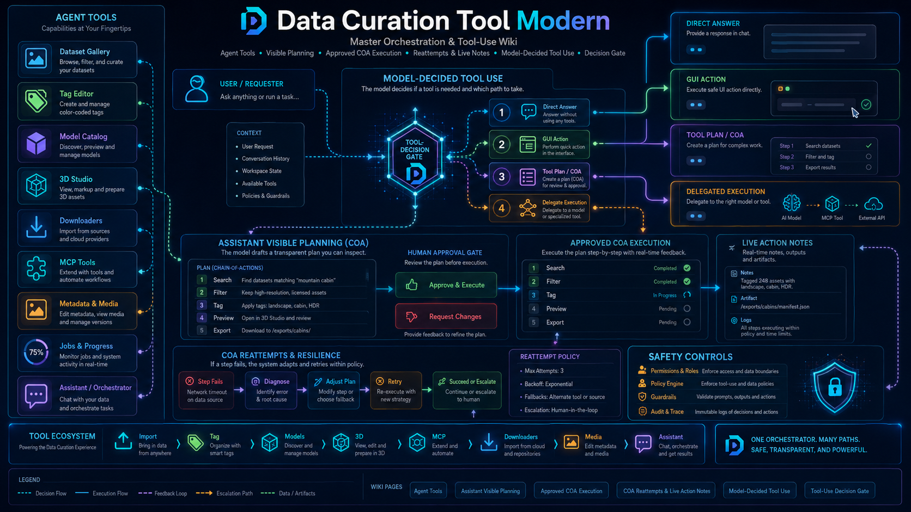

# Agent Tools

<!-- DCT_VISUAL_START -->

<!-- DCT_VISUAL_END -->

The **Agent Tools** runtime lets selected assistant/orchestrator models plan and run approved local tools from the full Agent Tools tab and from inline assistant panels on Tag Editor, Compare, Batch Tags, Assistant, and Code Assistant.

The design follows the modern function-calling pattern:

1. The app defines available tools with JSON schemas.
2. The model proposes a structured tool call or plan.
3. You approve the specific local action.
4. The action runs as a normal job.
5. The result can be relayed back to the model for summarization or next-step planning.

## Available tools

- `run_shell_command` — PowerShell, CMD/batch, Bash, or sh.
- `run_python_script` — writes/runs a generated Python script.
- `list_path` — lists files/folders under approved roots.
- `read_file` — reads approved text files.
- `write_file` — writes approved text files and creates backups.
- `fetch_url_text` — fetches HTTP(S) text/HTML.
- `open_browser` — launches Firefox/geckodriver; existing profile use is optional and disabled by default.

## Inline assistant use

Open a tab with an assistant panel, such as Tag Editor or Compare. Expand **Agent tools for this assistant**. The tool planner receives the current tab context, including selected media, tags, captions, selected tag chips, and the current model. Generate a plan, review the steps, check approval, and run only the action you approve.

## Result relay

After a tool job completes, use **Relay Last Tool Result** or **Relay Result to Assistant**. The assistant receives the job JSON and can summarize results, decide whether the task is complete, or propose the next approved step.

## Sandbox modes

Settings → **Agent Tools Safety / Function-Calling Runtime** controls sandbox behavior:

- **workspace**: default path-scoped execution.
- **local**: direct local execution, still approval-gated.
- **docker**: optional Docker execution using the configured image.

Docker is optional; if Docker is not installed, workspace/local modes still work.

## Safety guidance

Keep approval enabled. Keep allowed roots narrow. Use the workspace for temporary scripts. Existing Firefox profile use can expose active sessions/cookies and should only be enabled intentionally.
