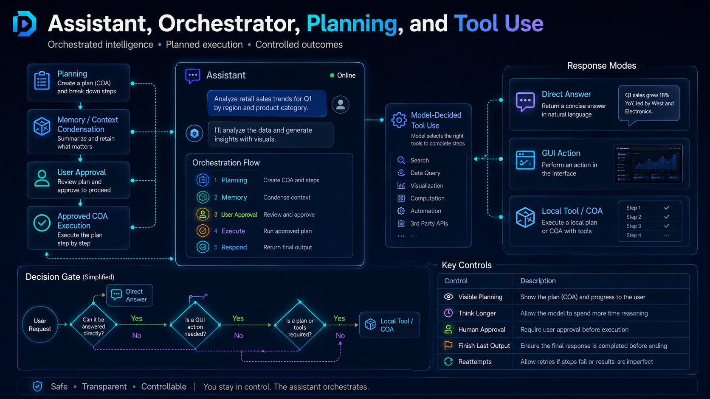

# Assistant Visible Planning and Think-Longer Mode

<!-- DCT_VISUAL_START -->

<!-- DCT_VISUAL_END -->

The tool supports a visible planning layer for assistant-capable local and cloud models. This helps the user see what the assistant intends to do before reading the final response or approving tool actions.

## What it is

Visible planning is a concise, user-facing plan generated as a separate model pass. It can include:

- the goal
- the context the assistant intends to use
- the steps it will follow
- risk or uncertainty notes
- the next action

This is separate from the final answer.

## What it is not

This is not hidden/private chain-of-thought extraction. Some hosted providers and runtimes do not expose internal reasoning. The app therefore asks the selected model for a separate visible plan/action-note artifact instead.

## Settings

Open **Settings → Assistant Thinking / Visible Planning Defaults**.

Useful presets:

- `fast`: one quick planning pass or none, shorter responses.
- `balanced`: recommended default for normal tag/editor conversations.
- `deep`: larger response budget for long explanations, coding, complex tag cleanup, and multi-step tool planning.
- `off`: disables plan-before-answer behavior.

## Per-surface controls

Assistant-enabled areas expose collapsible controls named **Think longer / visible plan controls**. These let you override defaults for the current chat or task.

## Finish Last Output

For smaller local models that stop mid-sentence, use **Finish Last Output**. The app sends the recent answer tail and asks the model to continue without repeating already-shown text.

## Tag-selection tasks

For critical tag operations, the app still uses completion guards and the `[TASK_COMPLETE]` marker. Preview mode can show partial/uncertain results, but non-preview operations are blocked if the model still appears incomplete after continuation attempts.
