# GitHub Wiki Source Folder

This folder contains the GitHub-wiki-ready documentation set for **Data Curation Tool Modern**.

Use it in either of these ways:

1. Keep it in the project as normal developer documentation under `docs/wiki/`.
2. Copy the Markdown files and the `assets/` folder into the GitHub repository wiki after creating the wiki once in the browser.

Repository: https://github.com/x-CK-x/Dataset-Curation-Tool

Recommended GitHub wiki import process:

```bash
# In a separate folder, clone the GitHub wiki repo after creating the wiki once in the browser.
git clone https://github.com/x-CK-x/Dataset-Curation-Tool.wiki.git
cd Dataset-Curation-Tool.wiki

# Copy every file from DataCurationToolModern/docs/wiki/ into this wiki repo, including assets/.
git add .
git commit -m "Add Data Curation Tool Modern wiki"
git push
```


## Visual documentation map

All visuals are stored in `assets/images/` and are referenced with repo-local paths so they work after the files are pushed to GitHub.

| Area | Visual | Local path |
|---|---|---|
| Repository overview | 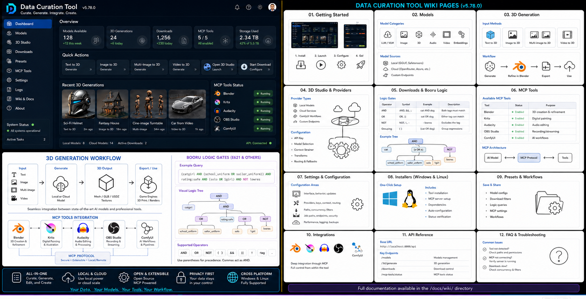 | `assets/images/repo_main_visual_index.png` |
| Main GUI face | 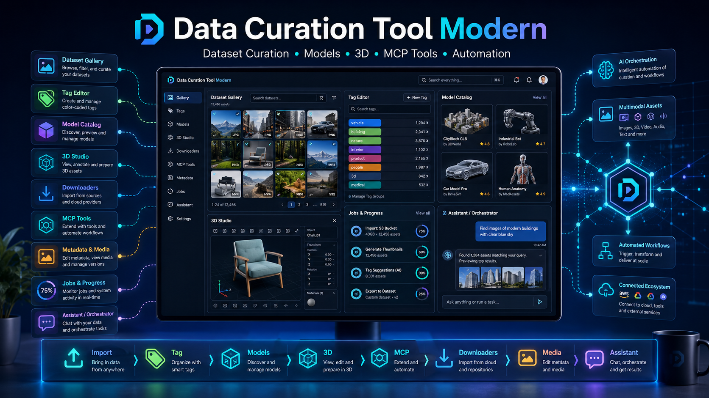 | `assets/images/main_gui_face.png` |
| Quick start | 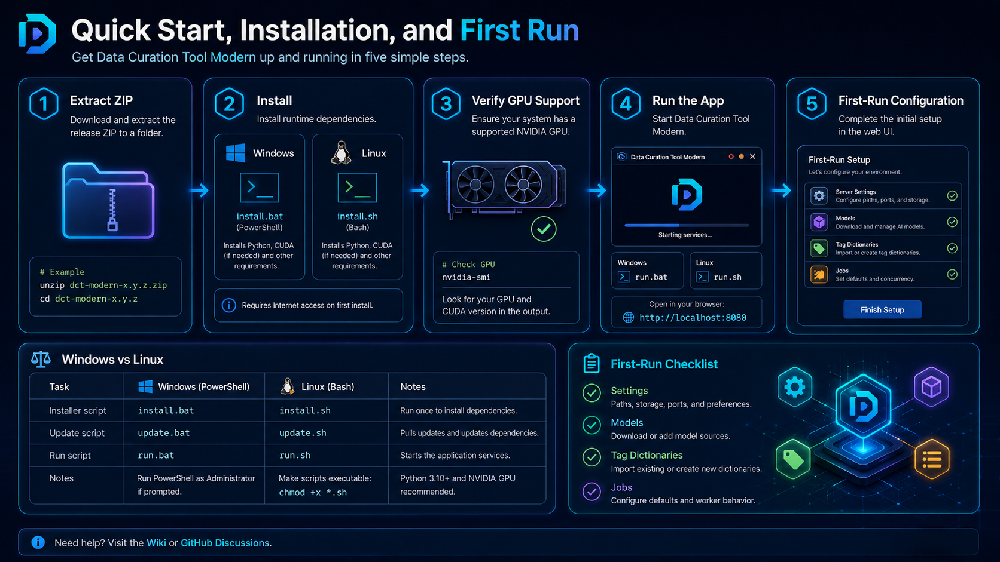 | `assets/images/quick_start_overview.png` |
| Windows install | 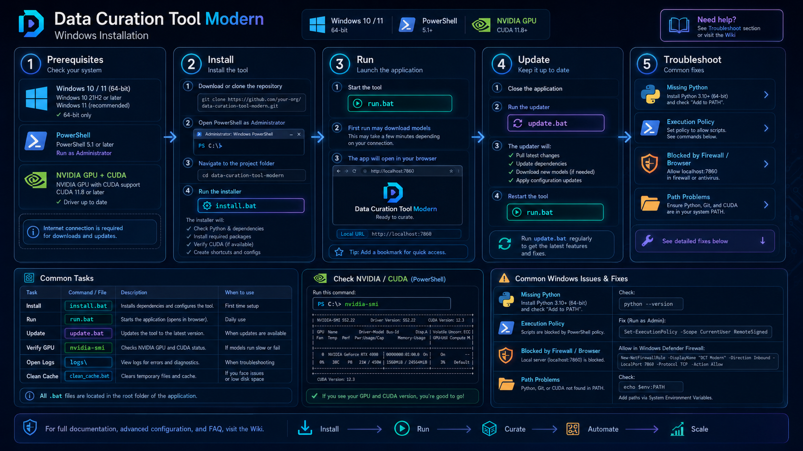 | `assets/images/windows_installation.png` |
| First run | 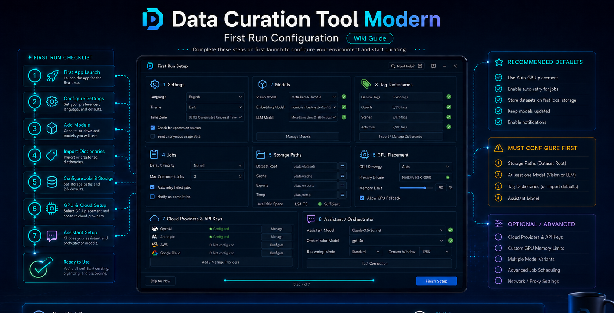 | `assets/images/first_run_configuration.png` |
| Folder layout and migration | 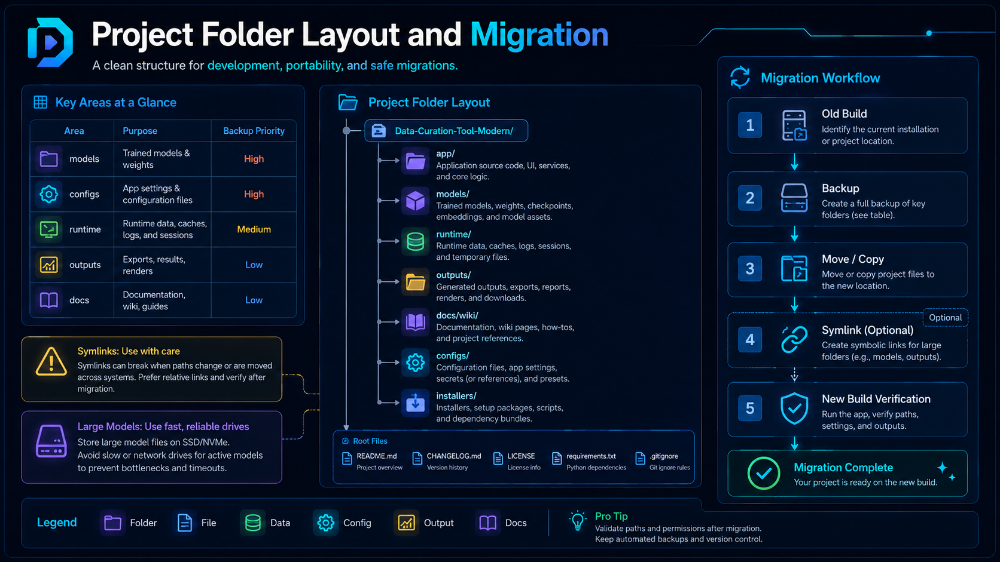 | `assets/images/project_folder_layout_migration.png` |
| Import workflow | 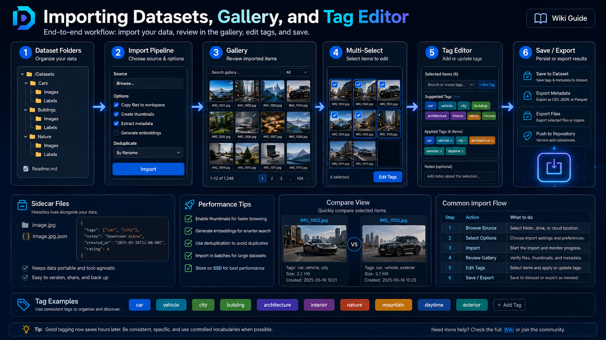 | `assets/images/dataset_import_workflow.png` |
| Gallery and tags | 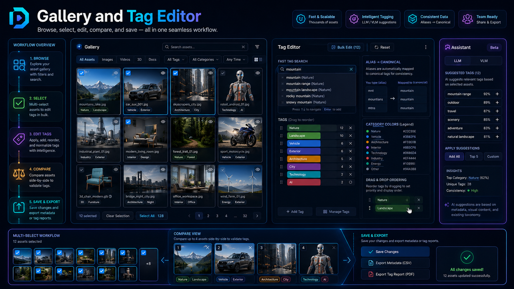 | `assets/images/gallery_tag_editor.png` |
| Models and GPU jobs | 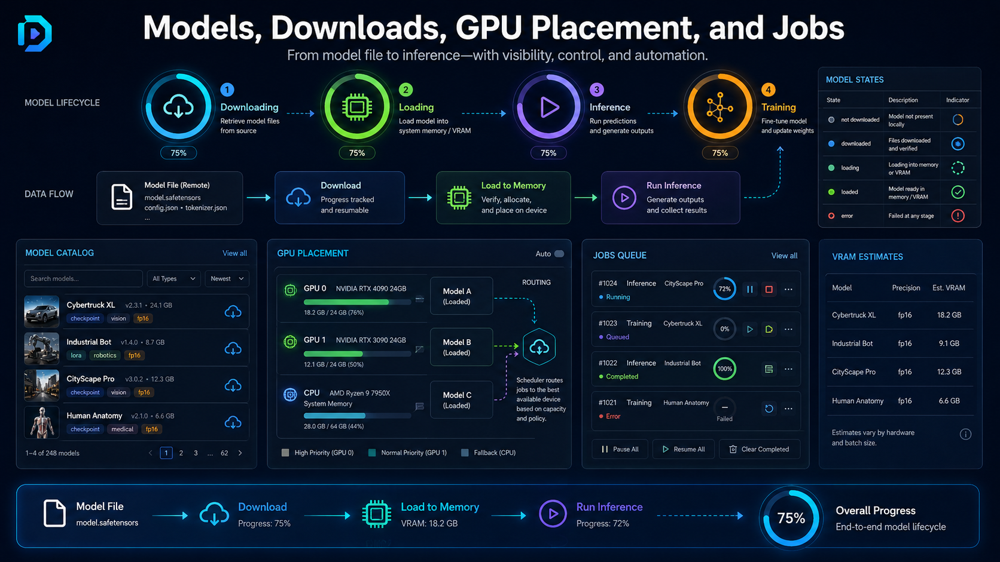 | `assets/images/model_lifecycle_gpu_jobs.png` |
| Assistant and orchestration | 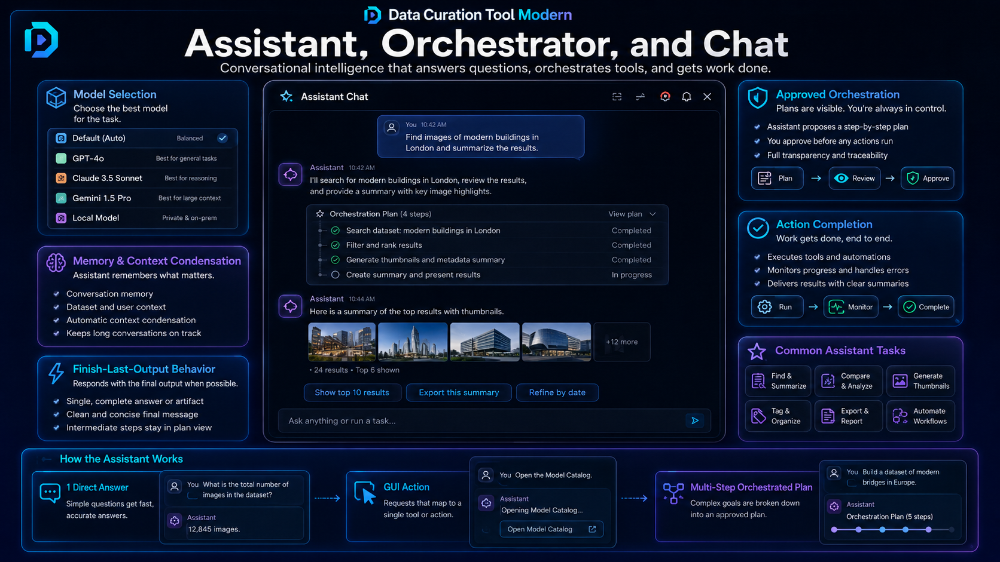 | `assets/images/assistant_orchestrator_chat.png` |
| Detection, pose, and 3D | 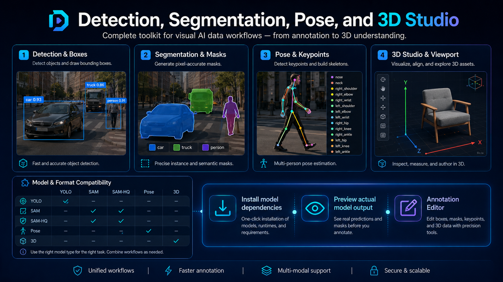 | `assets/images/annotation_detection_segmentation_pose_3d.png` |
| Downloaders and logic gates | 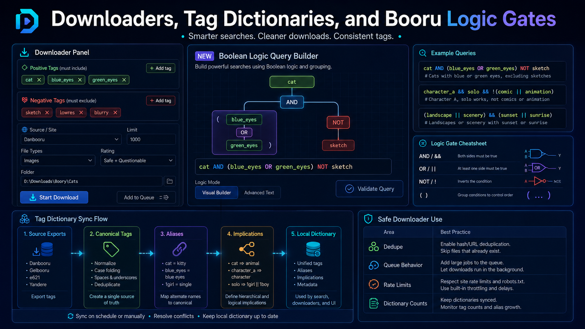 | `assets/images/downloaders_tag_dictionaries_logic.png` |
| Metadata, media, MCP tools | 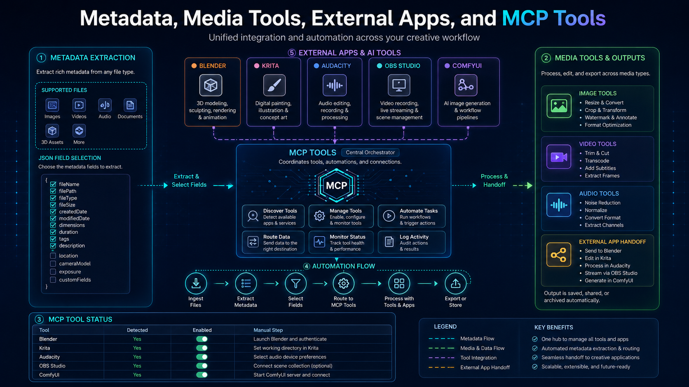 | `assets/images/metadata_media_mcp_tools.png` |
| Jobs and troubleshooting | 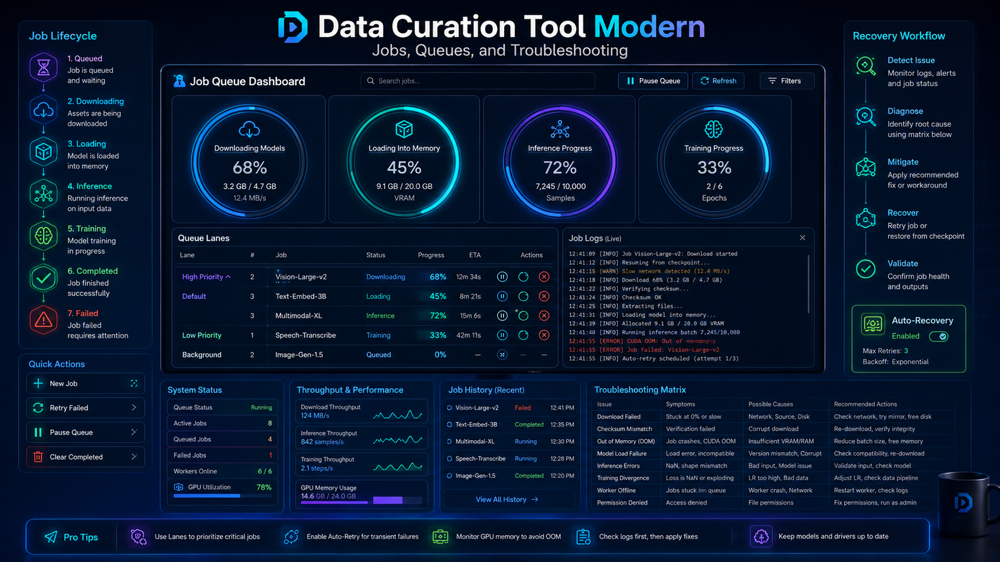 | `assets/images/jobs_queues_troubleshooting.png` |
| Best practices | 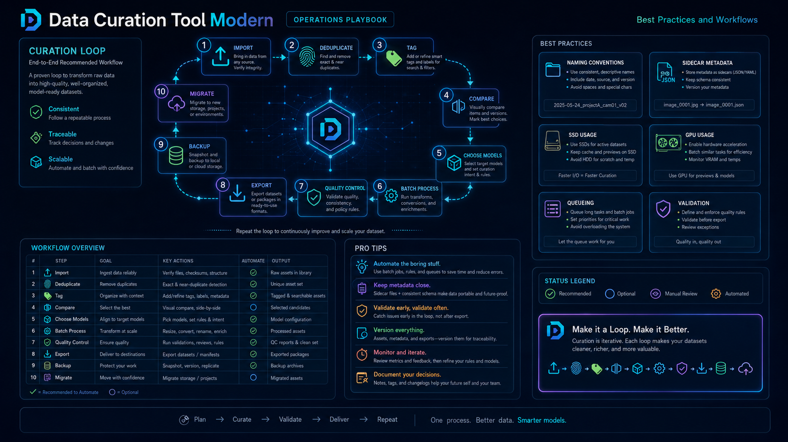 | `assets/images/best_practices_operations_playbook.png` |
| Voice and roadmap | 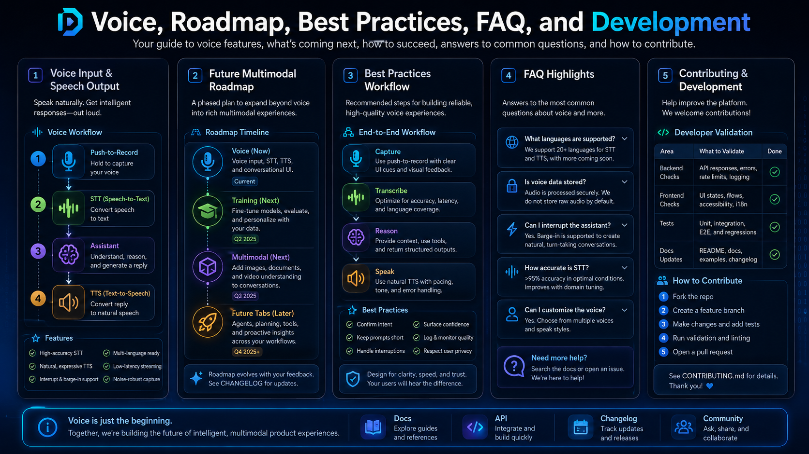 | `assets/images/voice_roadmap_best_practices_faq_dev.png` |
| Voice model catalog | 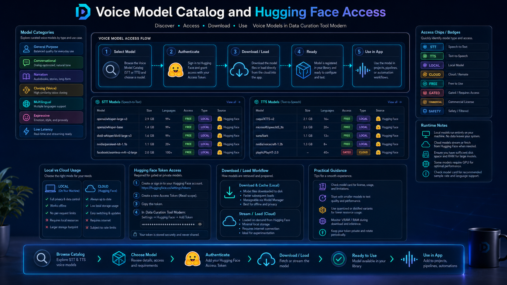 | `assets/images/voice_model_catalog_hf_access.png` |
| v5.78 3D/MCP/cloud/logic overview | 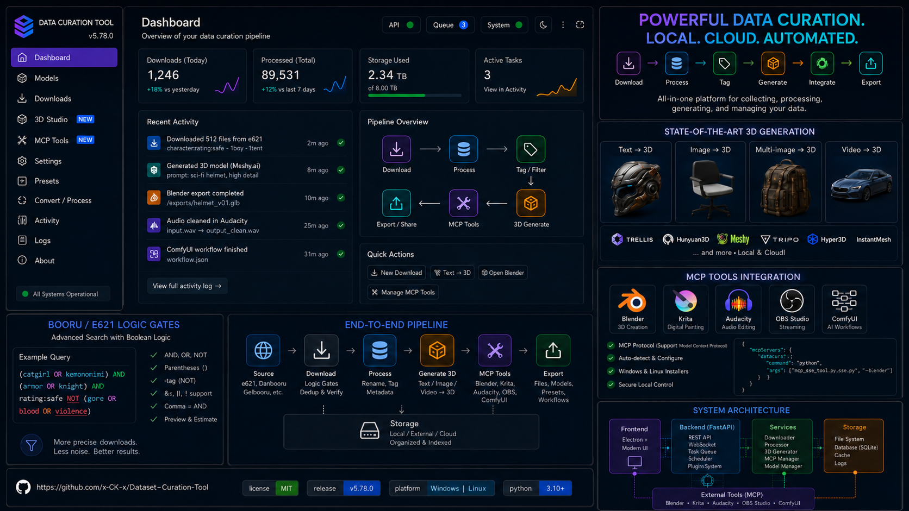 | `assets/images/v578_3d_cloud_mcp_logic_overview.png` |

## Notes

- Image links are local relative paths.
- There are no references to a project website, hosted docs site, Discord, community site, or status page.
- The only public project URL used here is the GitHub repository URL above.
