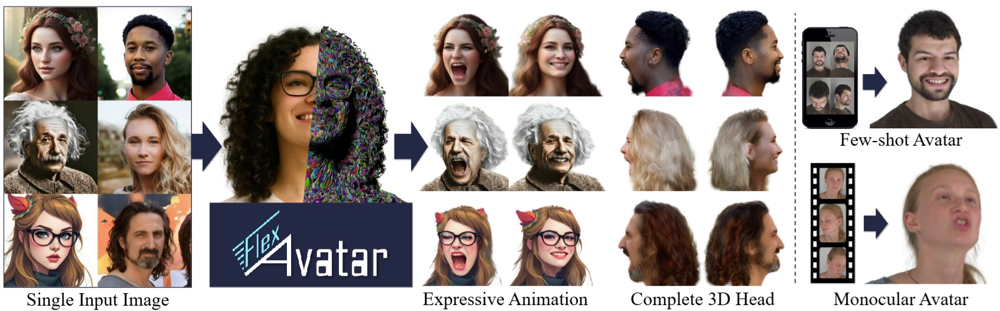
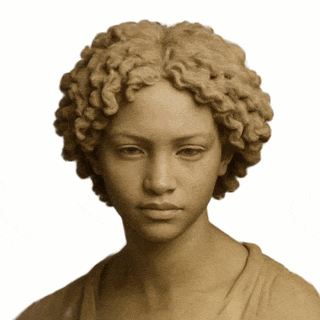
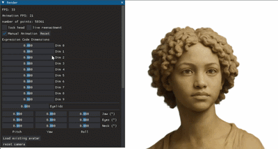

# Official Implementation of FlexAvatar [CVPR '26]
From the paper *"FlexAvatar: Learning Complete 3D Head Avatars with Partial Supervision"*


[Paper](https://tobias-kirschstein.github.io/flexavatar/static/FlexAvatar_paper.pdf) | [Video](https://youtu.be/g8wxqYBlRGY) | [Project Page](https://tobias-kirschstein.github.io/flexavatar/)  


[Tobias Kirschstein](https://tobias-kirschstein.github.io/), [Simon Giebenhain](https://simongiebenhain.github.io/), [Matthias Nießner](https://www.niessnerlab.org/)  
**CVPR 2026**

## 1. Setup

### 1.1. Quick Setup (only example inference)
1. Create conda environment `flexavatar` with newest PyTorch and CUDA 11.8:
    ```shell
    conda env create -f environment.yml
    ```

2. Install the `flexavatar` Python module
    ```shell
    pip install -e .
    ```
3. Download the pre-trained `FlexAvatar` model weights file from [https://nextcloud.tobias-kirschstein.de/index.php/s/X29kqKNndpSAKfB](https://nextcloud.tobias-kirschstein.de/index.php/s/X29kqKNndpSAKfB) and put it into `models/FLEX-1/checkpoints/ckpt-900k.pt`.

### 1.2. Full Setup

4. Install [Pixel3DMM](https://simongiebenhain.github.io/pixel3dmm/). Due to the complexity of the original Pixel3DMM repository, we provide a packaged version here that you can install via
   ```shell
   pip install git+https://github.com/tobias-kirschstein/easy-pixel3dmm.git
   pip install --extra-index-url https://miropsota.github.io/torch_packages_builder pytorch3d==0.7.9+pt2.7.1cu118
   pip install --no-build-isolation git+https://github.com/NVlabs/nvdiffrast.git
   ```
   Once all dependencies for `Pixel3DMM` are installed, you need to run the setup script
   ```shell
   python -m pixel3dmm.scripts.install_preprocessing_pipeline
   ```

# 2. Usage 

## 2.1. Render & Animate Example Avatars


The folder [data/inputs/itw](data/inputs/itw) contains example input images for which all preprocessing files are already present in the repository.
For these images, 3D head avatars can be created and rendered via:
```shell
python scripts/render_example.py
```
The script supports these parameters among others:
 * `--source_person ${source_person}`: Which avatar to create (available ones are in `data/inputs/itw`)
 * `--driving_sequence $seq`: Which video should be used to reenact the avatar. By default, you can choose driving videos from the NeRSemble dataset (available ones are in `data/pixel3dmm_processing/tracking/nersemble/240`). If `--use_itw_driver` is set, you can instead use your own tracked video to animate the avatar (see [section 2.2](#22-create-avatars-for-custom-inputs) for tracking)
 * `--render_360`: Render a 360° trajectory instead of the default frontal circular trajectory
 * `--load_avatar_code`: Load a previously stored avatar code to skip the avatar creation and fitting stages
 * `--help`: Display more options

The resulting renderings will be stored in the `renderings` folder in the repository.
Additionally, the corresponding avatar code will be stored in `data/avatar_codes/avatar_code_${source_person}.npy`. The avatar code can be loaded by future instantiations of the rendering script (by setting `--load_avatar_code`) to skip the avatar creation and fitting stages. It can also be loaded by the GUI (see [section 2.4](#24-interactive-viewer))

## 2.2. Create Avatars for Custom Inputs


Ensure you have run the full setup instructions following [section 1.2](#12-full-setup).

1. Put any portrait image (.jpg/.png) into `data/inputs/itw`. For example `${source_person}.jpg`
2. Run Pixel3DMM tracking via
   ```shell
   python scripts/track_pixel3dmm_itw.py ${source_person} 
   ```
   The resulting tracking output will be written into `data/pixel3dmm_processing/tracking/itw/${source_person}`.
3. Now you can create and render your avatar as described in [section 2.1](#21-render--animate-example-avatars), e.g. via 
   ```shell
   python scripts/render_example.py --source_person ${source_person}
   ```

## 2.3. Drive Avatars with Custom Videos
Ensure you have run the full setup instructions following [section 1.2](#12-full-setup).

1. Put any portrait video (.mp4) into `data/inputs/itw`. For example `${driving_video}.mp4`
2. Run Pixel3DMM tracking via
   ```shell
   python scripts/track_pixel3dmm_itw.py ${driving_video} 
   ```
3. You can now use your tracked driving video to animate an avatar as described in [section 2.1](#21-render--animate-example-avatars), e.g. via
   ```shell
   python scripts/render_example.py --driving_sequence ${driving_video} --use_itw_driver
   ```

## 2.4. Interactive Viewer



The interactive GUI can be started via

```shell
python scripts/run_gui.py
```

It supports:
 - Free 3D exploration
 - Loading avatar codes (e.g., those created by `render_example.py` in [section 2.1](#21-render--animate-example-avatars))
 - manually animating individual FLAME expression code dimensions via sliders

Note, you need to run `render_example.py` once before such that the GUI has an avatar code to load.

For live-reenactment to work, make sure you have `SHeaP` installed:
```shell
pip install git+https://github.com/tobias-kirschstein/sheap-3.9.git
```

<hr>

If you find this repository useful please consider citing
```bibtex
@inproceedings{kirschstein2026flexavatar,
  title={Flexavatar: Learning complete 3d head avatars with partial supervision},
  author={Kirschstein, Tobias and Giebenhain, Simon and Nie{\ss}ner, Matthias},
  booktitle={Proceedings of the IEEE/CVF Conference on Computer Vision and Pattern Recognition},
  pages={18193--18203},
  year={2026}
}
```